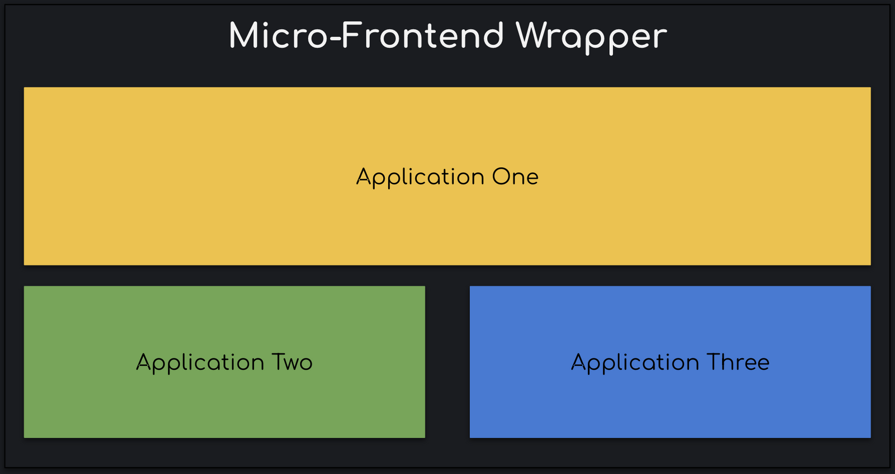

# What's a _Micro-Frontend?_

The **micro-frontend** concept is vaguely inspired by, and named after, micro-services. It is essentially to split frontend monoliths into smaller, simpler code bases that can be developed, tested and deployed independently, while still appearing to end users as a single application

Here's a simple illustration which explains this concept:



Figure 1: Micro-Frontend Wrapper

The main application `Wrapper` (For lack of a better name 🤷🏽‍♂️), renders applications `One` , `Two` and `Three` which are independent web applications. They could be hosted on the same domain where the `Wrapper` is, or they could be hosted somewhere else. The key takeaway here is that, no matter where and how your application is hosted, or even what framework your application uses, we can render it in our `Wrapper`.

# Why to use Micro-Frontends?

The main benefits of splitting your code base into micro-frontends are

-   Independent Updates: We can update and deploy `N` applications independent of other applications.
-   Simpler code base: Compared to a monolithic application, our *Micro-Frontend *code base will be much simpler and easier to maintain.
-   Independent Teams: Team A working on _Micro-Frontend_ A will have complete ownership over their code base, from inception to deployment. So now instead of having a "HTML" team and a "CSS style" team, we have independent teams working on applications
-   Shared Component Library/Styles:
-   Library/Framework Agnostic: The best part, one can technically have an Angular and a React app running in a plain JavaScript shell 🕺🏽

Now that we understand what a *Micro-frontend *is and how it benefits us, let's look at different design patterns for building one ourselves.

# Exploring the _Micro-Frontend_ Design Patterns

Note that the design patterns we will explore here is based on Client side rendering, i.e all the logic involved in rendering the applications are on the client. A wrapper application will be responsible for loading our individual *Micro-frontend. *The Wrapper application will handle user authentication, routing to respective *Micro-Frontend, *un-mounting the applications, etc.

-   _Micro-Frontends_[using an iFrame](#iframe-wrapper)
-   _Micro-Frontends_[as dependencies](#installing-as-dependency)
-   _Micro-Frontends_[using a runtime render function.](#runtime-render-function)

Let's look at each pattern in detail:

## iFrame Wrapper

This is one of the easier approaches to include Micro-Frontends in your app. I know, this doesn't seem "innovative". Developers generally tend to hate iFrames due to inconsistency with navigation, scrolling issues, responsive styling, inconsistent screen reader behaviours and more. But majority, if not all, of these draw-backs can be addressed if the implementation is well planned.

```html
<html>
    <head>
        <title>Micro-Frontends are Awesome!</title>
    </head>

    <body>
        <h3>Application One<h3>
        <iframe id="mf-container-one" src="/application-one"/>

        <h3>Application One<h3>
        <iframe id="mf-container-two" src="/application-two"/>

        <h3>Application One<h3>
        <iframe id="mf-container-three" src="/application-three"/>
    </body>
</html>
```

Using this approach, we can get started with the Micro-Frontend pattern really quickly. None of the Teams have to make any changes to their codebase, except for the team maintaining the wrapper, which can be config based as well. Styles are also isolated and this pattern works well when we have multiple applications on the same page like widgets.

The drawbacks are mostly around the issues described above around iFrames. Deep-linking, routing and managing history requires extra engineering effort. Data and event sharing between applications becomes challenging, but it is do-able if the event/data sharing architecture is well planned. Another issue is that if the applications are hosted on different domains, then we need to enable the **`X-Frame-Options`** header, which makes your application vulnerable.

## Installing as dependency

In this pattern, each Micro-Frontend application is published as a package, and is installed by the wrapper as dependencies.

```json
{
	"name": "@micro-frontend/container",
	"version": "1.0.0",
	"description": "A food delivery web app",
	"dependencies": {
		"@micro-frontend/one": "1.0.0",
		"@micro-frontend/two": "1.0.0",
		"@micro-frontend/three": "1.0.0"
	}
}
```

This approach means that we have to re-build and release every single `Micro-Frontend` in order to release a change to any individual part of the application. Having gone to all of the trouble of dividing our application into individual projects that can be developed and tested independently, let's not re-introduce all of that dependency during deployment.

## Runtime Render Function

In this pattern, we expose a render method from each of the Micro-Frontends, and the `Wrapper` loads these applications on-demand.

We keep a map of all the bootstrap methods exposed by individual applications. These apps don't render as soon as their `main.js` script is downloaded, but rather wait till the `render${app}` methods are called.

```html
<html>
	<head>
		<title>MicroFrontends are awesome!</title>
	</head>
	<body>
		<h1>Application {applicationName}</h1>
		<div id="mf-container"></div>
	</body>
	<!-- These scripts don't render anything on load -->
	<!-- Instead they attach entry-point functions to `window` object -->
	<script src="https://one.micro.dev/main.js"></script>
	<script src="https://two.micro.dev/main.js"></script>
	<script src="https://three.micro.dev/main.js"></script>
	<script type="text/javascript">
		// These render functions are attached to window by the above scripts
		const microFrontendsMap = {
			'application-one': window.renderOne,
			'application-two': window.renderTwo,
			'application-three': window.renderThree,
		};
		const renderApplication = loadMF(microFrontendsMap);

		// loadMF() decides which application needs to be rendered
		// and we call render function attached to the window object
		renderApplication('mf-container');
	</script>
</html>
```

With this approach, we can work with deep-linking, managing history and routing much easier as compared to the iFrame approach. In cases where your *Micro-Frontend *is composed of a singular framework like React/Angular, we can have a shared vendor bundle for the _Micro-Frontends_, all applications use same version of React, so we bundle it and serve for all the applications. We are also able to make the application responsive, and work with screen readers.

One issue which one may encounter is, when using multiple versions of a framework on the same page. Say Application `One` and `Two`  use different versions of React, when using hooks, one might see the infamous "`hooks can only be called inside the body of a function component`" error. This can be mitigated by using a single vendor file for the framework. _And as long as your team does not update the framework packages every alternate day, you should be good._ Of course, this depends on how your team is structured and what versions of framework each team uses, whether or not you want the application to run in a stand alone mode and so on.

# Show me the code!

> This example is using React. I'll get around to building something similar using Angular sometime in the future.

First we start with the `MicroFrontend` component. This component will be responsible for

-   Loading the scripts required to run the independent applications,
-   Loading the styles required by the independent applications,
-   Mounting and Un-Mounting the applications based on application logic

The entire concept behind our `MicroFrontend` component lies in the fact that the individual applications expose the render lifecycle method and the scripts in order of execution. In React, this is done by generating an `asset-manifest.json` file during build.

A typical `asset-manifest.json` will look something like this:

```json
{
	"files": {
		"main.css": "/static/css/main.chunk.css",
		"main.js": "/static/js/main.chunk.js",
		"runtime-main.js": "/static/js/runtime-main.js"
	},
	"entrypoints": ["static/js/runtime-main.js", "static/css/main.css", "static/js/main.js"]
}
```

-   `**files**` : are the files which are present in your `public` or `dist` folder. (Depends on where your build files are)
-   `**entrypoints**` : this lists the order in which the files should be loaded. In the above example, we must load the `runtime-main.js` before loading the `main.js` as it contains React related stuff which is required by the application.

Assuming that each _Micro-Frontend_ app is hosted somewhere, `MicroFrontend` component should be able to get the `asset-manifest.json` for each of the applications, and download the required scripts and styles.

```javascript
    /**
         * Fetches the asset-manifest.json for the given `host` and
         * injects the scripts and styles to the wrapper
         */
        loadScripts() {
            const {match, host, containerId} = this.props;
            this.abortController = new AbortController();
            fetch(`${host}/asset-manifest.json`, {
                signal: this.abortController.signal
            })
              .then(res => res.json())
              .then(manifest => {
                  const entryPoints = manifest['entrypoints'] || [];
                  // Identify and split JS and CSS files
                  const {styles, scripts} = this.identifyFiles(entryPoints);
                  // Inject the styles to the document.
                  styles.forEach(style => {
                      this.loadStyles(style)
                  });
                  // Load the scripts asynchronously, and call the renderMethod
                  this.scriptCache.load(scripts).then((event) => {
                      if(this.props.host === host)
                        this.renderMicroFrontend();
                  });
              });
        }
```

In the `loadScripts()` method, we do exactly that. We fetch the `asset-manifest.json` for a specified `host` (`https://one.micro.dev/asset-manifest.json`), iterate through the `entrypoints` and identify _`.js` and _`.css` files. Then we inject these files to our document.

```jsx
     renderMicroFrontend = () => {
            const {name, window, containerId} = this.props;
            if(window[`render${name}`]){
                window[`render${name}`](containerId);
            }
        };

        render() {
            const {containerId} = this.props;
            return <main id={containerId}/>;
        }
```

The render method is fairly simple. We have a `<main>` element with an id, which is set when the component is used. We use this element as the node where we want to render our application.

When we change the `containerId` the previous application gets unmounted as the node gets removed from the DOM. This way we are able to control mounting and un-mounting applications from a wrapper.

The `renderMicroFrontend` method calls the `render` method of the application which needs to be displayed.

```jsx
import React from 'react';
import ReactDOM from 'react-dom';
import * as serviceWorker from './serviceWorker';
import App from './App';
import './index.scss';

window.renderOne = (containerId) => {
	ReactDOM.render(<App />, document.getElementById(containerId));

	// If you want your app to work offline and load faster, you can change
	// unregister() to register() below. Note this comes with some pitfalls.
	// Learn more about service workers: https://bit.ly/CRA-PWA
	serviceWorker.unregister();
};

window.unmountOneUser = (containerId) => {
	ReactDOM.unmountComponentAtNode(document.getElementById(containerId));
};
```

As we can see above, we expose a render method which the wrapper application hosting this _Micro-Frontend_ will call. This means that the wrapper application would need to know the name of the render method for each of the _Micro-Frontends,_ either at build time, or via some API calls. This is upto you on how you'd want to expose and call the render methods.

Putting together everything we did, this is our `MicroFrontend` component.

```jsx
class MicroFrontend extends React.Component {
	scriptCache;
	abortController;

	constructor(props) {
		super(props);
		this.state = {
			containerId: '',
		};
		this.scriptCache = new ScriptCache();
	}

	componentDidMount() {
		this.loadScripts();
	}

	/**
	 * Fetches the asset-manifest.json for the given `host` and
	 * injects the scripts and styles to the wrapper
	 */
	loadScripts() {
		const { match, host, containerId } = this.props;
		this.abortController = new AbortController();
		fetch(`${host}/asset-manifest.json`, {
			signal: this.abortController.signal,
		})
			.then((res) => res.json())
			.then((manifest) => {
				const entryPoints = manifest['entrypoints'] || [];
				// Identify and split JS and CSS files
				const { styles, scripts } = this.identifyFiles(entryPoints);
				// Inject the styles to the document.
				styles.forEach((style) => {
					this.loadStyles(style);
				});
				// Load the scripts asynchronously, and call the renderMethod
				this.scriptCache.load(scripts).then((event) => {
					if (this.props.host === host) this.renderMicroFrontend();
				});
			});
	}

	/**
	 * Identify and split JS and CSS files.
	 */
	identifyFiles() {
		let styles = [];
		let scripts = [];
		entryPoints.forEach((path) => {
			path.includes('.css')
				? styles.push(`${host}/${path}`)
				: scripts.push(`${host}/${path}`);
		});
		return { scripts, styles };
	}

	loadStyles = (style, containerId, index) => {
		const styleId = `style-${containerId}${index}`;
		if (!document.getElementById(styleId)) {
			const styleRef = document.createElement('link');
			styleRef.setAttribute('rel', 'stylesheet');
			styleRef.setAttribute('type', 'text/css');
			styleRef.setAttribute('href', style);
			document.head.appendChild(styleRef);
		}
	};

	/**
	 * If an update happens, and the containerId is different,
	 * we unmount the previous app before mounting the new app
	 */
	componentDidUpdate(prevProps, prevState, snapshot) {
		if (prevProps.containerId !== this.props.containerId) {
			// we are trying to unmount previous app
			const { name } = prevProps;
			const { window, containerId } = this.props;
			this.unmountMicroFrontend(name, window, containerId);
			this.loadScripts();
		}
	}

	componentWillUnmount() {
		const { containerId, window, name } = this.props;
		this.unmountMicroFrontend(name, window, containerId);
	}

	unmountMicroFrontend = (name, window, containerId) => {
		if (this.abortController) {
			this.abortController.abort();
		}
		if (window[`unmount${name}`]) {
			window[`unmount${name}`](containerId);
		}
	};

	renderMicroFrontend = () => {
		const { name, window, containerId } = this.props;
		if (window[`render${name}`]) {
			window[`render${name}`](containerId);
		}
	};

	render() {
		const { containerId } = this.props;
		return <main id={containerId} />;
	}
}

MicroFrontend.propTypes = {
	host: PropTypes.string.isRequired,
	name: PropTypes.string.isRequired,
	containerId: PropTypes.string.isRequired,
	history: PropTypes.object,
	match: PropTypes.object,
};

export default MicroFrontend;
```

To use this component, we will need to specify some props.

```jsx
const Wrapper = () => {
	return (
		<MicroFrontend
			host={url}
			name={spaName}
			containerId={applicationId}
			history={history}
			match={match}
		/>
	);
};
```

-   `**host**`: The hostname where the _Micro-Frontend_ app is hosted.
-   `**name**`: Name of the _Micro-Frontend_ app which also doubles as the name of the render method exposed by the _Micro-Frontend_. The convention here is `render${name}`
-   `**containerId**`: ID of the `<main>` element where we want to inject our application
-   `**match**`, `**history**` : Optional props from `react-router` to manage deep-linking and stuff

As for the individual applications, we need to modify the bootstrap method and expose the render function via `window` object.

```jsx
import React from 'react';
import ReactDOM from 'react-dom';
import * as serviceWorker from './serviceWorker';
import App from './App';
import './index.scss';

window.renderOne = (containerId) => {
	ReactDOM.render(<App />, document.getElementById(containerId));
};

window.unmountOne = (containerId) => {
	ReactDOM.unmountComponentAtNode(document.getElementById(containerId));
};
```

The naming convention here is `render` and then the application name. In this case it is `One`.

Once we load the `main.js` for this application, it attaches the `render` method to the `window` object which can then be used for mounting and un-mounting the application dynamically.

Of course, this is just one way to do it. Other variants include having some kind of events, which tells the wrapper application that the _Micro-Frontend_ app is ready to render.

# Closing notes

We were able to build a _Micro-Frontend_ application using one of the design patterns and also satisfying [the requirements for a _Micro-Frontend_ application.](#why-to-use-micro-frontends)

This article turned out to be much longer than I anticipated, and we barely just scratched the surface. Maybe I'll convert this into a Part series, when I get around to creating some sample repos.

That's it for this episode. Reach out in case of any issues/help.

Until next time! ✌🏽
